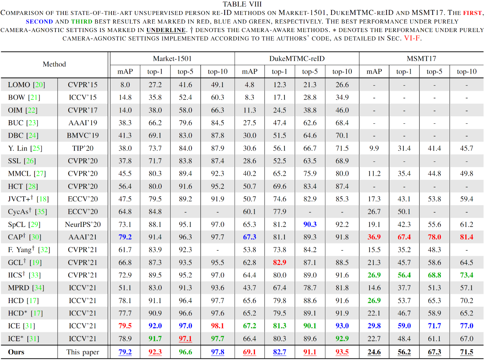

# Group Sampling
Rethinking Sampling Strategies for Unsupervised Person Re-identification [[arXiv]](https://arxiv.org/abs/2107.03024)

## Requirements

### Installation

```shell
git clone https://github.com/wavinflaghxm/GroupSampling.git
cd GroupSampling
python setup.py develop
```

### Prepare Datasets

```shell
cd examples && mkdir data
```
Download the person datasets [Market-1501](https://drive.google.com/file/d/0B8-rUzbwVRk0c054eEozWG9COHM/view), [DukeMTMC-reID](https://arxiv.org/abs/1609.01775), [MSMT17](https://arxiv.org/abs/1711.08565).
Then unzip them under the directory like:
```
GroupSampling/examples/data
├── market1501
│   └── Market-1501-v15.09.15
├── dukemtmc
│   └── DukeMTMC-reID
└── msmt17
    └── MSMT17_V2
```

## Training

We utilize 1 GTX-2080TI GPU for training.

+ Use `--group-n 256` for Market-1501, `--group-n 128` for DukeMTMC-reID, and `--group-n 1024` for MSMT17.

*Market-1501:*
```
python examples/train.py -d market1501 --logs-dir logs/market_resnet50 --group-n 256
```

*DukeMTMC-reID:*
```
python examples/train.py -d dukemtmc --logs-dir logs/duke_resnet50 --group-n 128
```

*MSMT17:*
```
python examples/train.py -d msmt17 --logs-dir logs/msmt_resnet50 --group-n 1024 --iters 800
```

We recommend using 4 GPUs to train MSMT17 for better performance.
```
CUDA_VISIBLE_DEVICES=0,1,2,3 python examples/train.py -d msmt17 --logs-dir logs/msmt_resnet50-gpu4 --group-n 1024 -b 256 --momentum 0.1 --lr 0.00005
```

## Evaluation
To evaluate the model, run:
```
python examples/test.py -d $DATASET --resume $PATH
```
**Some examples:**
```
### Market-1501 ###
python examples/test.py -d market1501 --resume logs/market_resnet50/model_best.pth.tar
```


## Results


## Acknowledgements

Codes are built upon [SpCL](https://github.com/yxgeee/SpCL). Thanks to Yixiao Ge for opening source.
